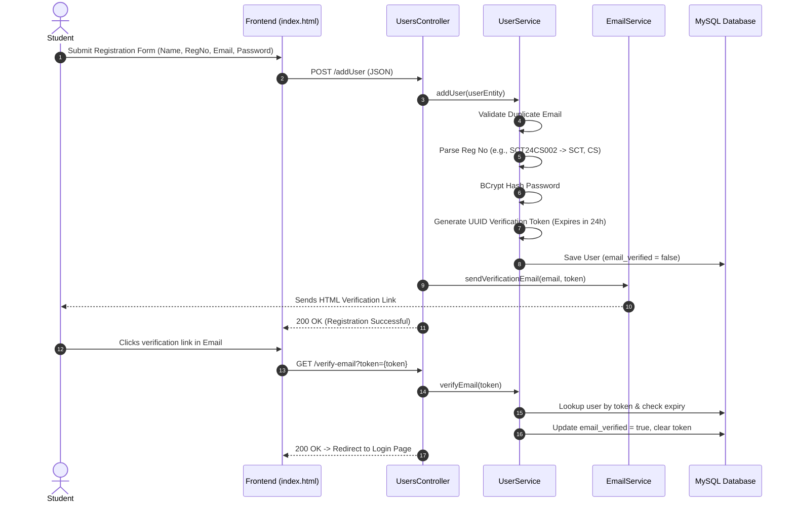
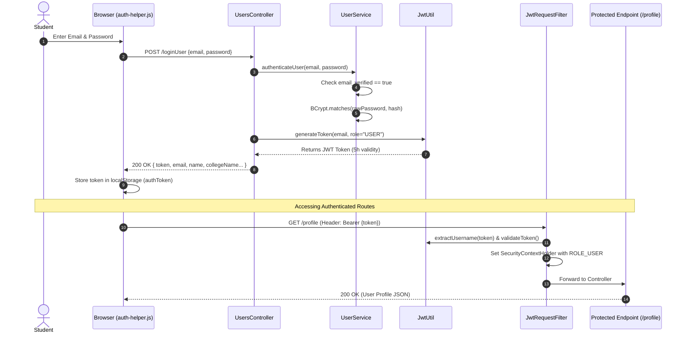
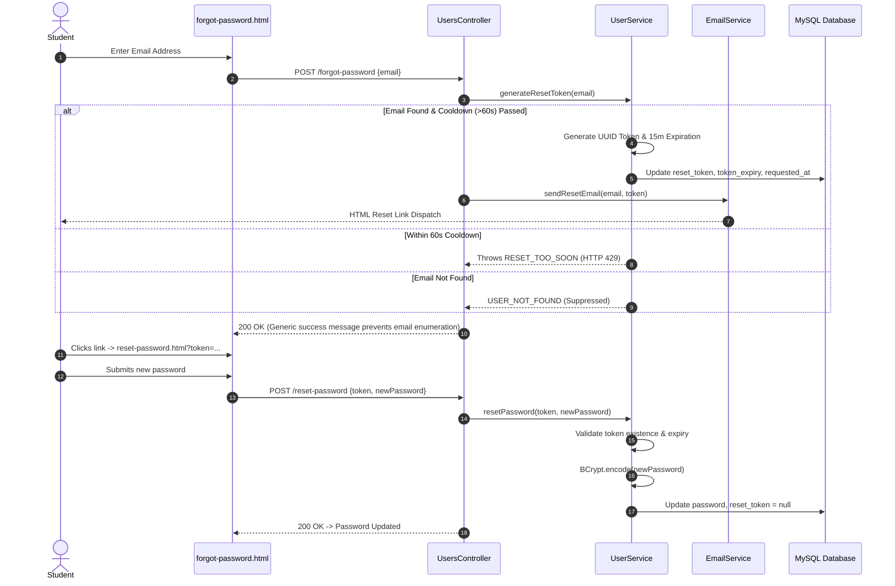
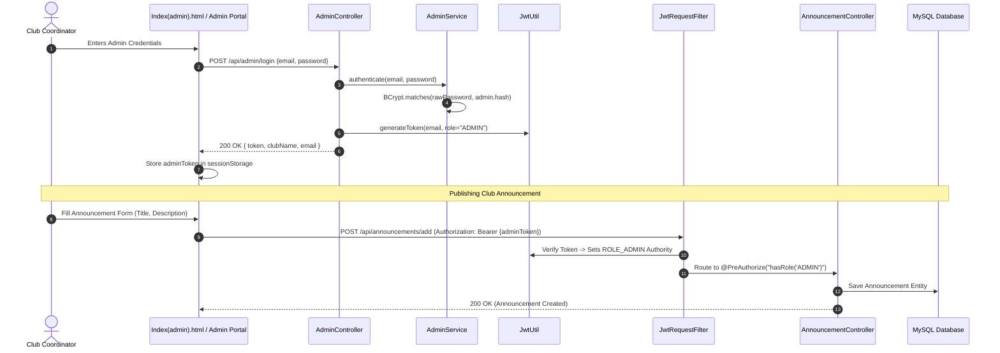
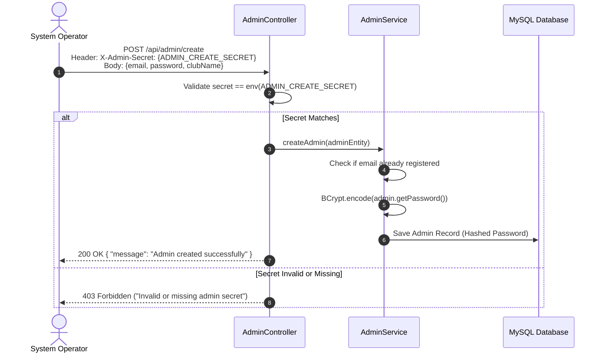

# 🎓 Communa — Comprehensive System Documentation & Architectural Guide

[](https://www.oracle.com/java/)
[](https://spring.io/projects/spring-boot)
[](https://jwt.io/)
[](https://www.mysql.com/)
[](https://www.docker.com/)
[](https://github.com/Inactive-Dude/communa-app/actions)
[](LICENSE)

---

## 📑 Table of Contents

1. [System Overview](#-system-overview)
2. [Complete Project Structure](#-complete-project-structure)
3. [System Architecture & Workflows](#-system-architecture--workflows)
   - [1. User Registration & Email Verification](#1-user-registration--email-verification-workflow)
   - [2. User Authentication & JWT Session Flow](#2-user-authentication--jwt-session-flow)
   - [3. Forgot & Reset Password Flow](#3-forgot--reset-password-workflow)
   - [4. Admin Authentication & Club Publishing Flow](#4-admin-authentication--club-publishing-workflow)
   - [5. One-Time Admin Account Provisioning](#5-one-time-admin-provisioning-workflow)
   - [6. Profile Auto-Extraction Logic](#6-profile-auto-extraction-logic)
4. [Component & File Logic Breakdown](#-component--file-logic-breakdown)
   - [Security & Authentication Layer](#security--authentication-layer)
   - [Controllers Layer](#controllers-layer)
   - [Services Layer](#services-layer)
   - [Entities & Repositories Layer](#entities--repositories-layer)
   - [Frontend Client Scripts & Auth Helpers](#frontend-client-scripts--auth-helpers)
   - [Frontend HTML Pages Structure](#frontend-html-pages-structure)
   - [Configuration & DevOps Files](#configuration--devops-files)
5. [Database Schema & Indexes](#-database-schema--indexes)
6. [REST API Specifications](#-rest-api-specifications)
7. [Setup & Deployment Guide](#-setup--deployment-guide)
8. [License Details](#-license-details)

---

## 🌟 System Overview

**Communa** is a full-stack web platform engineered for universities and college campuses to centralize student club operations, event broadcasting, notifications, and student profile verification.

### Core Capabilities:
- **Stateless Role-Based Access Control**: Discrete privileges for Students (`ROLE_USER`) and Club Coordinators (`ROLE_ADMIN`).
- **Cryptographic Security**: BCrypt password hashing (10 rounds), signed HMAC-SHA256 JWT tokens, rate-limited email dispatching, and protection against user enumeration.
- **Dynamic Registration Data Ingestion**: Automated extraction of college name, department, and academic branch from University Registration Numbers (e.g. `SCT24CS002`).
- **Multi-Container & Cloud-Native Setup**: Multi-stage Docker packaging, Docker Compose orchestration, dev/prod Spring profiles, and automated CI validation.

---

## 📂 Complete Project Structure

```
communa_1/
│
├── .github/
│   └── workflows/
│       └── ci.yml                               # GitHub Actions CI pipeline (Build, Test, Docker validation)
│
├── src/
│   ├── main/
│   │   ├── java/com/login/communa/
│   │   │   ├── CommunaApplication.java          # Spring Boot main application entry point
│   │   │   │
│   │   │   ├── Controller/                      # REST API Endpoints & Request Handling
│   │   │   │   ├── AdminController.java         # Admin login and secure admin provisioning endpoints
│   │   │   │   ├── AnnouncementController.java  # Club announcement retrieval and admin creation
│   │   │   │   ├── EventController.java         # Club event scheduling and public listing
│   │   │   │   ├── SpaController.java           # Forwarding for single-page routing
│   │   │   │   └── UsersController.java         # Registration, authentication, email verification, profile, reset flow
│   │   │   │
│   │   │   ├── Entity/                          # JPA Database Entities
│   │   │   │   ├── Admin.java                   # Admin account entity (credentials & club mapping)
│   │   │   │   ├── Announcement.java            # Club announcement entity (title, body, club, timestamp)
│   │   │   │   ├── Event.java                   # Club event entity (title, date, time, location, club)
│   │   │   │   └── Users.java                   # Student account entity (credentials, tokens, academic details)
│   │   │   │
│   │   │   ├── Repository/                      # Spring Data JPA Data Access Interfaces
│   │   │   │   ├── AdminRepository.java         # Custom queries for Admin entity (findByEmail)
│   │   │   │   ├── AnnouncementRepository.java  # Custom queries for Announcements (findByClubNameOrderByPostedAtDesc)
│   │   │   │   ├── EventRepository.java         # Custom queries for Events (findByClubNameOrderByDateAsc)
│   │   │   │   └── UsersRepo.java               # Custom queries for Users (findByEmail, tokens)
│   │   │   │
│   │   │   ├── Security/                        # Spring Security & JWT Architecture
│   │   │   │   ├── JwtRequestFilter.java        # OncePerRequest filter extracting and verifying Bearer JWTs
│   │   │   │   ├── JwtUtil.java                 # Token generation, parsing, claim validation, role extraction
│   │   │   │   └── SecurityConfig.java          # FilterChain, CORS configuration, Method Security, password encoder
│   │   │   │
│   │   │   └── Service/                         # Business Logic & External Integrations
│   │   │       ├── AdminService.java            # BCrypt admin verification & onboarding logic
│   │   │       ├── AnnouncementService.java     # Announcement CRUD operations
│   │   │       ├── EmailService.java            # JavaMailSender HTML template dispatcher (Verification/Reset)
│   │   │       ├── EventService.java            # Event management business logic
│   │   │       └── UserService.java             # User lifecycle, academic code parsing, token expiration
│   │   │
│   │   └── resources/
│   │       ├── application.yml                  # Unified Spring Boot configuration & profile selector
│   │       ├── application-dev.yml              # Development profile (SQL debug, verbose logging)
│   │       ├── application-prod.yml             # Production profile (DDL validation, pool optimization, file logging)
│   │       ├── application.properties           # Empty placeholder redirecting to YAML configurations
│   │       │
│   │       └── static/                          # Static Frontend Web Assets
│   │           │
│   │           ├── Client Auth & Helper Scripts
│   │           │   ├── admin-auth-helper.js     # Admin JWT validation & automatic Bearer header injection
│   │           │   ├── auth-helper.js           # Student session management, token storage, login redirects
│   │           │   ├── auth.js                  # Global authenticated route guard
│   │           │   ├── header-fluid.js          # Interactive webGL/canvas fluid header background
│   │           │   └── scripts.js               # WebGL canvas background animations
│   │           │
│   │           ├── Core Student Pages
│   │           │   ├── index.html               # Main landing page with animated login/register modal
│   │           │   ├── newpage.html             # Student dashboard homepage post-login
│   │           │   ├── Clubs.html               # Club discovery hub / directory
│   │           │   ├── Profile.html             # Student profile viewing and updating
│   │           │   ├── AboutUs.html             # Platform mission and developer details
│   │           │   └── Help.html                # Platform FAQs, documentation, and support
│   │           │
│   │           ├── Auth Flow Pages
│   │           │   ├── forgot-password.html     # Email request page for password reset
│   │           │   ├── reset-password.html      # New password entry page via reset token
│   │           │   └── verify-email.html        # Email verification status and resend trigger
│   │           │
│   │           ├── Admin Portals
│   │           │   ├── Index(admin).html        # Admin login page
│   │           │   ├── Coding Club(admin).html  # Coding Club administrator home
│   │           │   ├── CodingClub-announcements(admin).html # Coding Club announcement creation portal
│   │           │   ├── CodingClub-events(admin).html        # Coding Club event creation portal
│   │           │   ├── IEEE(admin).html         # IEEE administrator home
│   │           │   ├── IEEE-announcements(admin).html       # IEEE announcement creation portal
│   │           │   ├── IEEE-events(admin).html  # IEEE event creation portal
│   │           │   ├── NSS(admin).html          # NSS administrator home
│   │           │   ├── NSS-announcements(admin).html        # NSS announcement creation portal
│   │           │   └── NSS-events(admin).html   # NSS event creation portal
│   │           │
│   │           ├── Public Club Showcases
│   │           │   ├── Coding Club.html / CodingClub-announcements.html / CodingClub-events.html
│   │           │   ├── IEEE.html / IEEE-announcements.html / IEEE-events.html
│   │           │   ├── NSS.html / NSS-announcements.html / NSS-events.html
│   │           │   ├── CSI.html / CSI-announcements.html / CSI-events.html
│   │           │   ├── IEDC.html / IEDC-announcements.html / IEDC-events.html
│   │           │   ├── Meckartans.html / Meckartans-announcements.html / Meckartans-events.html
│   │           │   ├── Tinker Hub.html / Tinker Hub-announcements.html / Tinker Hub-events.html
│   │           │   ├── Clique.html / Clique-announcements.html / Clique-events.html
│   │           │   ├── Film Club.html / Film Club-announcements.html / Film Club-events.html
│   │           │   ├── Mulearn.html / Mulearn-announcements.html / Mulearn-events.html
│   │           │   ├── Music Club.html / Music Club-announcements.html / Music Club-events.html
│   │           │   ├── Velosters.html / Velosters-announcements.html / Velosters-events.html
│   │           │   └── Break through science society.html / Break through science society-announcements.html
│   │           │
│   │           └── Media & Styles
│   │               ├── style.css / styles.css   # Main responsive stylesheet & styling tokens
│   │               ├── Favicon.png              # Communa platform favicon
│   │               └── intro.mp4                # Landing page background video
│   │
│   └── test/                                    # Unit & Integration Tests
│
├── .env.example                                 # Environment variable template
├── .gitignore                                   # Git exclusion rules (safeguarding secrets, logs, targets)
├── docker-compose.yml                           # Production/Dev Docker multi-container stack
├── docker-compose.override.example.yml          # Optional local container overrides (Adminer DB UI)
├── Dockerfile                                   # Multi-stage container build definition (JDK → JRE Alpine)
├── init.sql                                     # Idempotent database & index initialization script
├── LICENSE                                      # MIT Open-Source License
├── mvnw / mvnw.cmd                              # Maven Wrapper executables
└── pom.xml                                      # Project dependencies & build configuration
```

---

## 🔄 System Architecture & Workflows

### 1. User Registration & Email Verification Workflow



---

### 2. User Authentication & JWT Session Flow



---

### 3. Forgot & Reset Password Workflow



---

### 4. Admin Authentication & Club Publishing Workflow



---

### 5. One-Time Admin Provisioning Workflow



---

### 6. Profile Auto-Extraction Logic

When a student registers or updates their university register number, `UserService` runs regex pattern matching against Kerala KTU/standard university registration formats:

$$\text{Format: } \underbrace{\text{[A-Z]\{3\}}}_{\text{College Code}}\underbrace{\backslash\text{d\{2\}}}_{\text{Admitted Year}}\underbrace{\text{[A-Z]\{2\}}}_{\text{Department Code}}\underbrace{\backslash\text{d\{3\}}}_{\text{Roll Number}}$$

```
Example Register Number: "SCT24CS002"
   ├── College Code: "SCT"   ───> "SCT College of Engineering"
   ├── Year Code:    "24"    ───> 2024
   ├── Dept Code:    "CS"    ───> "Computer Science & Engineering"
   └── Roll No:      "002"   ───> 002
```

---

## 🔍 Component & File Logic Breakdown

### Security & Authentication Layer

#### 1. [`SecurityConfig.java`](file:///c:/Users/aaron/OneDrive/Desktop/Final%20proj/communa_1/communa_1/src/main/java/com/login/communa/Security/SecurityConfig.java)
- **Role**: Master security topology and filter chain configurator.
- **Core Logic**:
  - Sets stateless session creation policy (`SessionCreationPolicy.STATELESS`).
  - Disables CSRF (not required for stateless bearer JWT architecture).
  - Explicitly restricts CORS to recognized application origins.
  - Whitelists public authentication endpoints (`/addUser`, `/loginUser`, `/forgot-password`, `/reset-password`, `/verify-email`, `/api/admin/login`).
  - Configures route-level access rules: Admin panels (`/**admin**.html`) require `ROLE_ADMIN`, while club viewer pages require `ROLE_USER` or `ROLE_ADMIN`.
  - Configures `WebSecurityCustomizer` to bypass filter overhead for static media (CSS, JS, PNG, MP4, fonts).
  - Instantiates `BCryptPasswordEncoder` bean.

#### 2. [`JwtUtil.java`](file:///c:/Users/aaron/OneDrive/Desktop/Final%20proj/communa_1/communa_1/src/main/java/com/login/communa/Security/JwtUtil.java)
- **Role**: JWT Token Lifecycle Manager.
- **Core Logic**:
  - Constructs cryptographic signing key from `jwt.secret` configuration at `@PostConstruct` using `Keys.hmacShaKeyFor`.
  - Signs tokens using `SignatureAlgorithm.HS256` with 5-hour expiration (`18,000,000 ms`).
  - Embeds and extracts `role` claims (`USER` or `ADMIN`) into JWT payload.
  - Verifies token expiration timestamp against `System.currentTimeMillis()`.

#### 3. [`JwtRequestFilter.java`](file:///c:/Users/aaron/OneDrive/Desktop/Final%20proj/communa_1/communa_1/src/main/java/com/login/communa/Security/JwtRequestFilter.java)
- **Role**: Request Interceptor Filter (`OncePerRequestFilter`).
- **Core Logic**:
  - Intercepts inbound HTTP requests and checks for `Authorization: Bearer <token>` header.
  - Extracts subject (username/email) and role claim using `JwtUtil`.
  - Builds `UsernamePasswordAuthenticationToken` with `ROLE_<ROLE>` granted authority.
  - Injects authentication token into `SecurityContextHolder` to authenticate downstream controllers and method guards.

---

### Controllers Layer

#### 1. [`UsersController.java`](file:///c:/Users/aaron/OneDrive/Desktop/Final%20proj/communa_1/communa_1/src/main/java/com/login/communa/Controller/UsersController.java)
- **Role**: Primary student interaction API.
- **Key Endpoints & Logic**:
  - `POST /addUser`: Handles `@Valid` registration, invokes user creation, sends verification email. Catches validation errors via custom `@ExceptionHandler`.
  - `POST /loginUser`: Authenticates credentials against BCrypt hashes; rejects unverified users with `403 EMAIL_NOT_VERIFIED`; issues JWT on success.
  - `GET /profile` & `PUT /profile`: Fetches and updates authenticated user records.
  - `POST /forgot-password`: Rate-limits requests (60s cooldown); returns generic 200 responses to suppress email existence leakage.
  - `POST /reset-password`: Validates token expiration and updates user password with BCrypt hashing.
  - `GET /verify-email`: Validates UUID token and activates student account.
  - `POST /resend-verification`: Re-dispatches a fresh verification token.

#### 2. [`AdminController.java`](file:///c:/Users/aaron/OneDrive/Desktop/Final%20proj/communa_1/communa_1/src/main/java/com/login/communa/Controller/AdminController.java)
- **Role**: Club administrator management API.
- **Key Endpoints & Logic**:
  - `POST /api/admin/login`: Verifies club admin credentials via `AdminService`; generates JWT token with `ADMIN` role claim.
  - `POST /api/admin/create`: Protected onboarding endpoint requiring `X-Admin-Secret` header matching the `ADMIN_CREATE_SECRET` environment variable.

#### 3. [`AnnouncementController.java`](file:///c:/Users/aaron/OneDrive/Desktop/Final%20proj/communa_1/communa_1/src/main/java/com/login/communa/Controller/AnnouncementController.java)
- **Role**: Club announcements broadcasting.
- **Key Endpoints & Logic**:
  - `GET /api/announcements/club/{clubName}`: Public feed of announcements ordered chronologically.
  - `POST /api/announcements/add`: Protected by `@PreAuthorize("hasRole('ADMIN')")`; saves announcement linked to the admin's club.

#### 4. [`EventController.java`](file:///c:/Users/aaron/OneDrive/Desktop/Final%20proj/communa_1/communa_1/src/main/java/com/login/communa/Controller/EventController.java)
- **Role**: Club events scheduling.
- **Key Endpoints & Logic**:
  - `GET /api/events/club/{clubName}`: Public listing of club events ordered by date.
  - `POST /api/events/add`: Protected by `@PreAuthorize("hasRole('ADMIN')")`; records title, date, time, and location.

#### 5. [`SpaController.java`](file:///c:/Users/aaron/OneDrive/Desktop/Final%20proj/communa_1/communa_1/src/main/java/com/login/communa/Controller/SpaController.java)
- **Role**: Static routing support forwarding client-side routes.

---

### Services Layer

#### 1. [`UserService.java`](file:///c:/Users/aaron/OneDrive/Desktop/Final%20proj/communa_1/communa_1/src/main/java/com/login/communa/Service/UserService.java)
- **Role**: Core student domain operations.
- **Core Logic**:
  - Manages password encoding (`BCryptPasswordEncoder`).
  - Maintains `COLLEGE_MAP` and `DEPT_MAP` dictionaries to translate registration numbers.
  - Enforces 60-second token generation cooldown (`RESET_COOLDOWN_SECONDS = 60`).
  - Sets 15-minute expiration windows on password reset tokens (`15 * 60 * 1000 ms`).
  - Sets 24-hour expiration windows on email verification tokens (`24 * 60 * 60 * 1000 ms`).

#### 2. [`AdminService.java`](file:///c:/Users/aaron/OneDrive/Desktop/Final%20proj/communa_1/communa_1/src/main/java/com/login/communa/Service/AdminService.java)
- **Role**: Admin credential authentication and entity creation.
- **Core Logic**:
  - Matches raw passwords against stored BCrypt hashes.
  - Encrypts admin passwords prior to database persistence.

#### 3. [`EmailService.java`](file:///c:/Users/aaron/OneDrive/Desktop/Final%20proj/communa_1/communa_1/src/main/java/com/login/communa/Service/EmailService.java)
- **Role**: SMTP HTML Email Dispatcher.
- **Core Logic**:
  - Utilizes `JavaMailSender` and `MimeMessageHelper`.
  - Dispatches responsive HTML emails featuring branded headers, call-to-action buttons, and expiry notices for verification and password reset workflows.

#### 4. [`AnnouncementService.java`](file:///c:/Users/aaron/OneDrive/Desktop/Final%20proj/communa_1/communa_1/src/main/java/com/login/communa/Service/AnnouncementService.java) & [`EventService.java`](file:///c:/Users/aaron/OneDrive/Desktop/Final%20proj/communa_1/communa_1/src/main/java/com/login/communa/Service/EventService.java)
- **Role**: Data access delegates querying repositories with custom ordering.

---

### Entities & Repositories Layer

- [`Users.java`](file:///c:/Users/aaron/OneDrive/Desktop/Final%20proj/communa_1/communa_1/src/main/java/com/login/communa/Entity/Users.java) & [`UsersRepo.java`](file:///c:/Users/aaron/OneDrive/Desktop/Final%20proj/communa_1/communa_1/src/main/java/com/login/communa/Repository/UsersRepo.java): Primary student table indexed by email with verification and reset token columns.
- [`Admin.java`](file:///c:/Users/aaron/OneDrive/Desktop/Final%20proj/communa_1/communa_1/src/main/java/com/login/communa/Entity/Admin.java) & [`AdminRepository.java`](file:///c:/Users/aaron/OneDrive/Desktop/Final%20proj/communa_1/communa_1/src/main/java/com/login/communa/Repository/AdminRepository.java): Club administrator table storing club affiliation and hashed passwords.
- [`Announcement.java`](file:///c:/Users/aaron/OneDrive/Desktop/Final%20proj/communa_1/communa_1/src/main/java/com/login/communa/Entity/Announcement.java) & [`AnnouncementRepository.java`](file:///c:/Users/aaron/OneDrive/Desktop/Final%20proj/communa_1/communa_1/src/main/java/com/login/communa/Repository/AnnouncementRepository.java): Club broadcast notices ordered by `postedAt DESC`.
- [`Event.java`](file:///c:/Users/aaron/OneDrive/Desktop/Final%20proj/communa_1/communa_1/src/main/java/com/login/communa/Entity/Event.java) & [`EventRepository.java`](file:///c:/Users/aaron/OneDrive/Desktop/Final%20proj/communa_1/communa_1/src/main/java/com/login/communa/Repository/EventRepository.java): Club events schedule ordered by `date ASC`.

---

### Frontend Client Scripts & Auth Helpers

- [`auth.js`](file:///c:/Users/aaron/OneDrive/Desktop/Final%20proj/communa_1/communa_1/src/main/resources/static/auth.js): Client-side router guard that inspects `localStorage.getItem('authToken')` upon DOM load and redirects unauthenticated visitors to `index.html`.
- [`auth-helper.js`](file:///c:/Users/aaron/OneDrive/Desktop/Final%20proj/communa_1/communa_1/src/main/resources/static/auth-helper.js): Provides utility methods `getAuthToken()`, `setAuthToken()`, `getUserData()`, `setUserData()`, and `authFetch()` to automatically attach `Authorization: Bearer <token>` to outbound AJAX requests.
- [`admin-auth-helper.js`](file:///c:/Users/aaron/OneDrive/Desktop/Final%20proj/communa_1/communa_1/src/main/resources/static/admin-auth-helper.js): Specialized helper for admin pages checking `sessionStorage.getItem('adminToken')` and wrapping fetch calls with admin authorization headers.
- [`scripts.js`](file:///c:/Users/aaron/OneDrive/Desktop/Final%20proj/communa_1/communa_1/src/main/resources/static/scripts.js) & [`header-fluid.js`](file:///c:/Users/aaron/OneDrive/Desktop/Final%20proj/communa_1/communa_1/src/main/resources/static/header-fluid.js): WebGL physics simulation rendering dynamic fluid cursor interactions across navigation headers.

---

### Frontend HTML Pages Structure

| Page | Audience | Description & Integrated Functionality |
|---|---|---|
| [`index.html`](file:///c:/Users/aaron/OneDrive/Desktop/Final%20proj/communa_1/communa_1/src/main/resources/static/index.html) | Public | Animated landing page with video hero, tabbed Login / Register modals, and unverified email modal triggers. |
| [`newpage.html`](file:///c:/Users/aaron/OneDrive/Desktop/Final%20proj/communa_1/communa_1/src/main/resources/static/newpage.html) | Student | Student hub dashboard showing registered clubs, upcoming highlights, and quick navigation. |
| [`Clubs.html`](file:///c:/Users/aaron/OneDrive/Desktop/Final%20proj/communa_1/communa_1/src/main/resources/static/Clubs.html) | Student | Visual club catalog with direct links to club portals, announcements, and schedules. |
| [`Profile.html`](file:///c:/Users/aaron/OneDrive/Desktop/Final%20proj/communa_1/communa_1/src/main/resources/static/Profile.html) | Student | View and edit profile details with live KTU registration number validation. |
| [`verify-email.html`](file:///c:/Users/aaron/OneDrive/Desktop/Final%20proj/communa_1/communa_1/src/main/resources/static/verify-email.html) | Public | Reads URL parameter `?token=...`, executes verification call, and provides resend email trigger. |
| [`forgot-password.html`](file:///c:/Users/aaron/OneDrive/Desktop/Final%20proj/communa_1/communa_1/src/main/resources/static/forgot-password.html) | Public | Email input form sending password reset requests with rate limit warnings. |
| [`reset-password.html`](file:///c:/Users/aaron/OneDrive/Desktop/Final%20proj/communa_1/communa_1/src/main/resources/static/reset-password.html) | Public | Password reset entry form verifying matching passwords and token parameter. |
| [`Index(admin).html`](file:///c:/Users/aaron/OneDrive/Desktop/Final%20proj/communa_1/communa_1/src/main/resources/static/Index(admin).html) | Admin | Dedicated admin authentication portal redirecting to club-specific management consoles. |
| `*-announcements(admin).html` | Admin | Secure dashboard for adding new announcements with club-level data binding. |
| `*-events(admin).html` | Admin | Secure dashboard for scheduling events with date, time, and location inputs. |

---

### Configuration & DevOps Files

- [`application.yml`](file:///c:/Users/aaron/OneDrive/Desktop/Final%20proj/communa_1/communa_1/src/main/resources/application.yml): Primary Spring Boot YAML configuration with profile-based overrides, HikariCP pool parameters, and mail properties.
- [`application-dev.yml`](file:///c:/Users/aaron/OneDrive/Desktop/Final%20proj/communa_1/communa_1/src/main/resources/application-dev.yml): Development profile enabling SQL formatting and verbose logger channels.
- [`application-prod.yml`](file:///c:/Users/aaron/OneDrive/Desktop/Final%20proj/communa_1/communa_1/src/main/resources/application-prod.yml): Production profile enforcing Hibernate schema validation (`ddl-auto: validate`), log file rotation, and suppressed client error traces.
- [`Dockerfile`](file:///c:/Users/aaron/OneDrive/Desktop/Final%20proj/communa_1/communa_1/Dockerfile): Multi-stage build producing an Alpine JRE container running as an unprivileged user (`communa`).
- [`docker-compose.yml`](file:///c:/Users/aaron/OneDrive/Desktop/Final%20proj/communa_1/communa_1/docker-compose.yml): Production stack definition spinning up MySQL 8 and the Communa web application with healthchecks.
- [`init.sql`](file:///c:/Users/aaron/OneDrive/Desktop/Final%20proj/communa_1/communa_1/init.sql): Schema creation script with performance indexing.
- [`.github/workflows/ci.yml`](file:///c:/Users/aaron/OneDrive/Desktop/Final%20proj/communa_1/communa_1/.github/workflows/ci.yml): GitHub Actions CI workflow executing Maven verification and Docker image builds.

---

## 🗄️ Database Schema & Indexes

```sql
CREATE DATABASE IF NOT EXISTS communa CHARACTER SET utf8mb4 COLLATE utf8mb4_unicode_ci;
USE communa;

-- 1. Users Table
CREATE TABLE IF NOT EXISTS users (
    email                       VARCHAR(255) NOT NULL PRIMARY KEY,
    name                        VARCHAR(255),
    admission_number            VARCHAR(100),
    university_register_number  VARCHAR(100),
    college_name                VARCHAR(255),
    branch                      VARCHAR(255),
    department                  VARCHAR(255),
    password                    VARCHAR(255) NOT NULL,
    email_verified              TINYINT(1)   NOT NULL DEFAULT 0,
    verification_token          VARCHAR(255),
    verification_token_expiry   DATETIME,
    reset_token                 VARCHAR(255),
    token_expiry                DATETIME,
    password_reset_requested_at DATETIME
);

-- 2. Admin Table
CREATE TABLE IF NOT EXISTS admins (
    id          BIGINT       NOT NULL AUTO_INCREMENT PRIMARY KEY,
    email       VARCHAR(255) NOT NULL UNIQUE,
    password    VARCHAR(255) NOT NULL,
    club_name   VARCHAR(255)
);

-- 3. Announcements Table
CREATE TABLE IF NOT EXISTS announcements (
    id          BIGINT        NOT NULL AUTO_INCREMENT PRIMARY KEY,
    title       VARCHAR(255),
    description VARCHAR(2000),
    club_name   VARCHAR(255),
    posted_at   DATETIME(6)   DEFAULT CURRENT_TIMESTAMP(6)
);

-- 4. Events Table
CREATE TABLE IF NOT EXISTS events (
    id          BIGINT        NOT NULL AUTO_INCREMENT PRIMARY KEY,
    title       VARCHAR(255),
    date        DATE,
    time        VARCHAR(255),
    location    VARCHAR(255),
    club_name   VARCHAR(255)
);

-- Performance Indexes
CREATE INDEX idx_announcements_club ON announcements (club_name);
CREATE INDEX idx_events_club        ON events (club_name);
CREATE INDEX idx_users_reset_token  ON users (reset_token);
CREATE INDEX idx_users_verify_token ON users (verification_token);
```

---

## 📡 REST API Specifications

### Student Authentication & Profile Endpoints

#### `POST /addUser`
- **Request Body**:
  ```json
  {
    "name": "Alex Johnson",
    "email": "alex@communa.edu",
    "password": "SecurePassword123!",
    "admissionNumber": "ADM-2024-098",
    "universityRegisterNumber": "SCT24CS045"
  }
  ```
- **Response `200 OK`**:
  ```json
  {
    "email": "alex@communa.edu",
    "name": "Alex Johnson",
    "collegeName": "SCT College of Engineering",
    "department": "Computer Science & Engineering",
    "message": "Registration successful! Please check your email to verify your account."
  }
  ```

#### `POST /loginUser`
- **Request Body**:
  ```json
  {
    "email": "alex@communa.edu",
    "password": "SecurePassword123!"
  }
  ```
- **Response `200 OK`**:
  ```json
  {
    "token": "eyJhbGciOiJIUzI1NiIsInR5cCI6IkpXVCJ9...",
    "email": "alex@communa.edu",
    "name": "Alex Johnson",
    "collegeName": "SCT College of Engineering"
  }
  ```

#### `GET /profile`
- **Headers**: `Authorization: Bearer <token>`
- **Response `200 OK`**: Complete user entity.

---

### Admin & Club Operations

#### `POST /api/admin/login`
- **Request Body**:
  ```json
  {
    "email": "admin.coding@communa.edu",
    "password": "AdminPassword123!"
  }
  ```
- **Response `200 OK`**:
  ```json
  {
    "status": "success",
    "token": "eyJhbGciOiJIUzI1NiIsInR5cCI6IkpXVCJ9...",
    "clubName": "CodingClub",
    "email": "admin.coding@communa.edu"
  }
  ```

#### `POST /api/admin/create`
- **Headers**: `X-Admin-Secret: <ADMIN_CREATE_SECRET>`
- **Request Body**:
  ```json
  {
    "email": "admin.ieee@communa.edu",
    "password": "IeeePassword2025!",
    "clubName": "IEEE"
  }
  ```

#### `POST /api/announcements/add`
- **Headers**: `Authorization: Bearer <adminToken>`
- **Request Body**:
  ```json
  {
    "title": "Hackathon 2025 Registration Open",
    "description": "24-hour intra-college hackathon on AI solutions.",
    "clubName": "CodingClub"
  }
  ```

#### `POST /api/events/add`
- **Headers**: `Authorization: Bearer <adminToken>`
- **Request Body**:
  ```json
  {
    "title": "IoT Workshop with ESP32",
    "date": "2025-09-15",
    "time": "10:00 AM",
    "location": "Electronics Lab, Block C",
    "clubName": "IEEE"
  }
  ```

---

## 🚀 Setup & Deployment Guide

### Native Environment Setup

1. **Clone the repository**:
   ```bash
   git clone https://github.com/Inactive-Dude/communa-app.git
   cd communa-app/communa_1
   ```

2. **Configure Environment Variables**:
   *PowerShell (Windows):*
   ```powershell
   $env:SPRING_PROFILES_ACTIVE = "dev"
   $env:DB_PASSWORD            = "pass"
   $env:JWT_SECRET             = "YourVeryLongAndSecureSecretKeyForCommunaApp_MustBeAtLeast256BitsLongForHS256"
   $env:ADMIN_CREATE_SECRET    = "communa-admin-2024"
   $env:MAIL_PASSWORD          = "your-gmail-app-password"
   ```

3. **Start Application**:
   ```powershell
   .\mvnw.cmd spring-boot:run
   ```

---

### Docker Stack Deployment

```bash
# Build and start all services in detached mode
docker-compose up -d --build

# View real-time application logs
docker-compose logs -f app

# Tear down the stack
docker-compose down
```

---

## 📄 License Details

This software is released under the **MIT License**.

```
MIT License

Copyright (c) 2025 Aaron George & Communa Contributors

Permission is hereby granted, free of charge, to any person obtaining a copy
of this software and associated documentation files (the "Software"), to deal
in the Software without restriction, including without limitation the rights
to use, copy, modify, merge, publish, distribute, sublicense, and/or sell
copies of the Software, and to permit persons to whom the Software is
furnished to do so, subject to the following conditions:

The above copyright notice and this permission notice shall be included in all
copies or substantial portions of the Software.

THE SOFTWARE IS PROVIDED "AS IS", WITHOUT WARRANTY OF ANY KIND, EXPRESS OR
IMPLIED, INCLUDING BUT NOT LIMITED TO THE WARRANTIES OF MERCHANTABILITY,
FITNESS FOR A PARTICULAR PURPOSE AND NONINFRINGEMENT. IN NO EVENT SHALL THE
AUTHORS OR COPYRIGHT HOLDERS BE LIABLE FOR ANY CLAIM, DAMAGES OR OTHER
LIABILITY, WHETHER IN AN ACTION OF CONTRACT, TORT OR OTHERWISE, ARISING FROM,
OUT OF OR IN CONNECTION WITH THE SOFTWARE OR THE USE OR OTHER DEALINGS IN THE
SOFTWARE.
```
